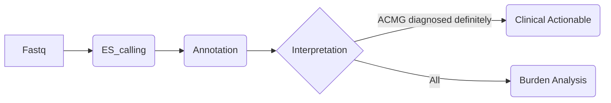

# The bioinformatics analysis pipeline for ES/GS of cerebral palsy

Due to the large sample size, snakemake was used to control job flow so pipelines have been splitted into small jobs. For more details, please refer to https://snakemake.readthedocs.io/en/stable/tutorial/tutorial.html.

The project consists of variants calling, annotation, interpretation and burden analysis. In most cases, you can run it directly after editing the configure file.

Please refer to sub-directories for details.
## Contact
Ye Cheng at Fudan University, China <chengy19@fudan.edu.cn>

